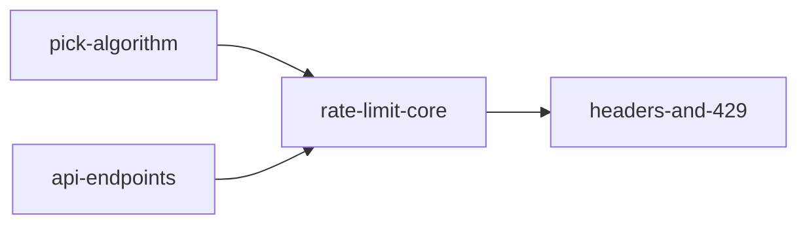

# Kumihimo — v0.1 Plan

組紐: many threads in, one cord out. You lay out a plan as a graph of plain-text
files; Kumihimo renders it as a picture you can arrange, and braids it into one
well-ordered prompt a coding agent can act on.

**Session decisions already made** (2026-08-23, with Thomas):

| Decision | Choice |
|---|---|
| On-disk format | Folder per plan, one Markdown file per node |
| v0.1 visual layer | Full graph editor, not just a viewer |
| Flagship workflow | Engineering plans fed to coding agents (Claude Code) |
| License | MIT |

Name check: `kumihimo` is **free on PyPI** as of 2026-08-23. Repo target: a free
public GitHub repository under your account.

Everything below marked **Judgment call** is mine and is open to challenge.

---

## 1. Scope

### v0.1 does

- **Model**: load, validate, and save a plan directory — typed nodes, two core
  edge kinds, user-defined node kinds with fields and templates.
- **Braid**: compile the graph into one deterministic prompt, with two shipped
  strategies (linear, grouped), Jinja2 templating, and scope filters.
- **Edit**: a local browser editor — see the graph, drag it into an arrangement,
  add/link/edit/delete nodes — that reads and writes the plan files. The files
  stay the only source of truth.
- **MCP**: a stdio MCP server exposing the same operations, so Claude can
  inspect, restructure, and braid a plan without touching files by hand.
- **CLI**: `new`, `add`, `link`, `check`, `braid`, `export`, `edit`, `mcp`.
- **Ship**: pip-installable from PyPI, documented well enough that a stranger
  goes from install to a compiled prompt in ten minutes.

The ten-minute story, concretely:

```
pip install kumihimo
kumihimo new myplan          # scaffolds a plan with the engineering pack
kumihimo edit myplan         # browser opens; arrange, add nodes
kumihimo braid myplan        # one prompt on stdout — paste it into an agent
```

### v0.1 does not

- **Execute anything.** No scheduler, no runtime, no agent orchestration, no
  status polling. Kumihimo compiles text; what runs the text is not our problem.
  This is the line that keeps us out of Airflow's territory.
- **Call an LLM.** No API keys, no network, no telemetry. A "parse this PRD into
  a plan" importer is an obvious v0.2 feature — via MCP Claude can already do it
  manually in v0.1, which is the cheaper 80%.
- **Cycles or conditionals.** The graph is a DAG; `check` rejects cycles and
  names the path. Conditional branches ("if X works, do Y else Z") are modeled
  as a `decision` node with the options in prose — resolution happens in the
  human's or agent's head, not in an engine. Cost of adding real conditionals
  later: a new edge kind and strategy, no format break.
- **Multi-user anything.** Local tool, one person (plus their agent) per plan.
  Git is the collaboration layer.
- **Hosted anything.** The editor server binds localhost only.

---

## 2. Prior art — borrow / avoid

The field splits into four families. Named lessons, most instructive first:

| Tool | Borrow | Avoid |
|---|---|---|
| **Node-RED, ComfyUI, LangFlow, Flowise** (visual-first flow builders) | Palette-of-node-kinds UX; how good drag-to-link can feel | The defining mistake for us: **the UI's JSON blob is the source of truth.** Diffs are unreviewable, hand-editing is hostile, merge is hopeless. Kumihimo inverts this: files first, UI second. |
| **Mermaid, D2, Graphviz** (diagram-as-code) | Text as truth; GitHub renders Mermaid natively, so `export --mermaid` gives free README embeds | One-way street: a DSL built for pictures can't carry paragraphs of prose. Our nodes are prose-heavy, so the diagram is a *projection*, never the format. |
| **Obsidian JSON Canvas, Excalidraw** | An openly specified, minimal format is a feature in itself | Positions and content in one file — every layout shuffle dirties the semantic diff. Hence our `view.yaml` sidecar. |
| **[Beads](https://github.com/steveyegge/beads)** (Yegge's git-backed issue graph for agents) | Git-as-database discipline; "ready work" = all deps done, as a first-class query; proof there's real demand for dependency-aware agent planning | Hash IDs (`bd-a1b2`) solve multi-agent merge collisions at the cost of human readability — wrong trade for hand-authored plans, so we use slugs. Beads also outgrew plain text into a Dolt SQL backend at thousands of agent-generated issues; Kumihimo plans are human-scale (tens of nodes) and stay plain text. |
| **[Task Master](https://docs.task-master.dev/capabilities/mcp)** (claude-task-master) | The MCP verb shape: `next_task`, `expand_task`, `get_tasks`. Also its cautionary tiering — it ships 36 tools and has to tell users to enable only 7 to save context. We ship ~10, once. | `tasks.json` as store (diffs poorly); scope creep into execution tracking and complexity analysis. |
| **GitHub spec-kit** | The *constitution* idea — plan-level guardrails prepended to every compiled prompt (our cord preamble); markdown artifacts per feature | Its task lists are flat documents; the graph structure Kumihimo exists for is precisely what it lacks. |
| **Microsoft PromptFlow** | Closest structural cousin: YAML DAG + Jinja2 template per node + a visual editor over the same file. Validates the whole architecture. | Everything embedded in one YAML; editor coupled to one IDE (VS Code). Project has gone quiet — coupling viz to a host you don't control ages badly. Ours is a plain browser page. |
| **Airflow, Dagster, Prefect** | Dependency semantics people already understand; Dagster's lesson that a graph tool lives or dies by its viz | The entire runtime half. The moment we "run" nodes we compete with them and lose. |
| **Snakemake / Make** | Dry-run culture: `braid --dry` prints the order without rendering, like `make -n` | DSL learning curve; implicit file-based dependency inference |
| **LangGraph, DSPy** | Nothing structural — they're runtime control flow | Confirms cycles/conditionals belong to *execution* frameworks, not plan formats |
| **Foam, Dendron, zk** (markdown knowledge graphs) | id = filename; frontmatter for typed metadata; wikilink ergonomics as a later affordance | Emergent, untyped graphs — fine for notes, useless to a compiler. Our edges are declared and validated. |
| **React Flow (xyflow)** | The editor substrate itself — MIT, mature, the de-facto standard for node editors | Rolling our own canvas; also Cytoscape.js, which is analysis-first and fights you on editor ergonomics |

Synthesis: **every tool that let the visual layer own the data regretted it;
every tool that kept text as truth kept its users.** And nobody in the list
compiles a *prose-bearing* graph into an ordered prompt — task-master and Beads
order work but don't render documents; PromptFlow renders but for runtime
execution. That compilation step is Kumihimo's actual novelty; the rest is
well-trodden ground where we deliberately copy.

---

## 3. Graph model

### 3.1 Where the generic/opinionated line goes

The central tension: fully generic means the compiler has nothing to grip;
fully opinionated means it's a task tracker with a diagram. My resolution:

**The core understands exactly five things: identity, prose, order, membership,
and annotation.** Everything else — what a node *means*, what fields it
carries, how it renders — lives in user-definable *kinds*.

Concretely, every node has:

- `id` — its file path (slug). Identity.
- `title` + `body` — prose. The compiler treats these as opaque text to place,
  never to interpret.
- `needs: [id...]` — the **ordering edge**. The only thing the compiler uses to
  sequence output.
- `in: [id...]` — the **membership edge**, pointing at any other node (usually
  a `milestone`). The only thing the grouped strategy uses to section output.
- `links: [{to, rel}]` — **annotation edges** with free-form relation labels
  (`informs`, `contradicts`, `see-also`). Rendered as cross-references, drawn
  in the editor, but *zero* compiler semantics. This is the pressure valve: any
  relationship users invent fits here without core changes, and if a pattern
  recurs across users, that's the evidence it earns promotion to core in v0.2.

Everything else on a node is a `fields:` bag validated by its kind. The
compiler never reads a kind-specific field directly — kinds' templates do, and
generic filters (`--where status=todo`) match on them by name. So the core
stays domain-agnostic *and* the compiler always has structure to work with,
because order and membership are core, not kind-level.

**Judgment call:** two semantic edge kinds, not one and not five. One (`needs`
only) was tempting, but grouping-by-milestone is what makes compiled output of
a 40-node plan readable, and faking membership with a field means the editor
can't draw it as an edge. Five (adding e.g. `blocks`, `produces`) is where I
stopped trusting my guesses — `links` catches those until usage votes.

### 3.2 Kinds

A kind declares fields (name, type, required, choices, default) and a Jinja2
template that renders one node of that kind into prompt text. Kinds are defined
in the plan manifest, or pulled from a shipped **pack**. v0.1 ships one pack,
`engineering`:

| Kind | Fields (beyond core) | Renders as |
|---|---|---|
| `task` | `status` (todo/doing/done/blocked), `effort` (S/M/L), `acceptance` (list) | A work item with explicit "after:" line and acceptance checklist |
| `milestone` | `target` (free text) | A section header with its members grouped beneath (grouped strategy) |
| `decision` | `status` (open/settled), `choice` | Settled → a binding constraint, stated firmly. Open → a flagged blocker |
| `risk` | `impact`, `mitigation` | A caution the agent must respect |
| `question` | `status` (open/answered), `answer` | Open → "resolve before dependents"; answered → context |

Field schemas are Pydantic-generated JSON Schema under the hood, which the
editor reuses for its property forms and the MCP server for tool documentation
— one definition, three consumers.

A plan can extend a pack kind (add a field, override the template) or define a
new kind inline. There is deliberately **no inheritance between kinds** — packs
are copied-in defaults, not a type hierarchy.

### 3.3 On-disk format

A plan is a directory; `kumihimo.yaml` marks the root.

```
apiguard/
  kumihimo.yaml        # manifest: plan meta, kinds, compile settings
  view.yaml            # editor layout only — positions, never semantics
  nodes/
    ship-guarded-api.md
    pick-algorithm.md
    api-endpoints.md
    rate-limit-core.md
    headers-and-429.md
    redis-outage.md
    per-org-quotas.md
```

Rules: `id` = path under `nodes/` minus `.md`, lowercase `[a-z0-9-/]` (enforced
— the repo must clone onto case-insensitive filesystems without collisions).
Subfolders namespace ids (`auth/login-flow`). Rename = `git mv` + referrer
fixup, which the CLI, editor, and MCP all do atomically.

**Worked example.** The manifest:

```yaml
# apiguard/kumihimo.yaml
format: 1
plan: API Guard
description: Add per-key rate limiting to the public API.
kinds:
  from: engineering          # ship-with pack
  task:
    fields:
      effort: {type: choice, options: [S, M, L]}   # extend pack kind
compile:
  strategy: grouped
  preamble: |
    You are implementing this plan in the api repo. Work strictly in the
    order given. Stop and ask if a settled decision proves wrong.
```

Two node files in full:

```markdown
--- nodes/pick-algorithm.md ---
---
kind: decision
title: Rate-limit algorithm
status: settled
choice: sliding-window counter in Redis
---
Token bucket allows bursts that our SLA language forbids; fixed windows
double-spend at boundaries. Sliding-window counter costs one ZSET per key
and we already run Redis for sessions.
```

```markdown
--- nodes/rate-limit-core.md ---
---
kind: task
title: Rate-limit middleware
needs: [api-endpoints, pick-algorithm]
in: [ship-guarded-api]
effort: M
acceptance:
  - 429 + Retry-After on breach
  - overhead under 2ms p99 at 1k rps
links:
  - {to: redis-outage, rel: threatened-by}
---
Middleware on every authenticated route. Read the key's window from Redis,
increment, compare against the tier limit. Fail *open* on Redis errors —
availability beats enforcement; see redis-outage for the standing mitigation.
```

And the layout sidecar — integers only, keys sorted, so a layout shuffle is a
two-line diff and merges trivially:

```yaml
# apiguard/view.yaml
layout:
  api-endpoints: {x: 40, y: 200}
  pick-algorithm: {x: 40, y: 60}
  rate-limit-core: {x: 320, y: 130}
```

**Write-back fidelity rule:** the body of a node file is preserved
byte-for-byte unless the edit *is* a body edit. Frontmatter round-trips through
`ruamel.yaml`, preserving key order and comments. "Kumihimo reformatted my
file" is a bug class we treat as data loss — golden round-trip tests from M1.

### 3.4 Validation (`check`)

Errors: cycles (path named), dangling `needs`/`in`/`links` targets, unknown
kind, missing required field, bad field value, id/filename mismatch,
duplicate-modulo-case ids, malformed frontmatter (with line numbers).
Warnings: orphan nodes (no edges at all), open `decision`/`question` nodes
that something `needs`, empty bodies. `check` is the same code path the
editor's live diagnostics panel and the MCP `check` tool call.

---

## 4. Prompt compilation — the braid

### 4.1 Pipeline

`braid = select → order → render → weave`, each stage overridable:

1. **Select** — the whole graph, or a slice: `--where status=todo` (matches any
   field, repeatable), `--from <id>` / `--until <id>` (ancestor/descendant
   cones), `--in <milestone>`. Selection always pulls in enough context:
   excluded direct dependencies of included nodes are rendered as one-line
   stubs ("already done: api-endpoints — v2 endpoint surface") so the prompt
   never references a ghost.
2. **Order** — deterministic topological sort: Kahn's algorithm with a sorted
   ready-queue, tie-broken by (`priority` field descending, then id ascending).
   Same plan in, byte-identical prompt out, on every OS and Python version —
   this is a hard invariant with golden tests, because diffable output is what
   makes template changes reviewable.
3. **Render** — each node through its kind's Jinja2 template (sandboxed), with
   context: `node` (id/title/body/fields), `deps` and `dependents` (id+title),
   `group`, `plan`. Templates state structure in prose — every task renders an
   explicit `after: <dep titles>` line.
4. **Weave** — the cord template wraps the rendered nodes: manifest preamble →
   graph overview → sections → numbered nodes → epilogue. Fully user-overridable
   per plan.

### 4.2 Strategies

Pluggable order/weave policies; v0.1 ships two, registered in an internal
registry that also loads third-party `kumihimo.strategies` entry points:

- **`linear`** — one topological sequence, numbered.
- **`grouped`** (default for the engineering pack) — sections by `in`-membership
  in dependency order between groups (group A precedes B if anything in B needs
  anything in A; a cycle *at group level* falls back to linear with a warning),
  ungrouped nodes in a final section, topological order within each.

### 4.3 What the compiler does with structure that has no linear order

This was flagged as a core design question, so, explicitly: a DAG usually has
*many* valid orders, and pretending otherwise wastes the graph. The braid
handles it three ways:

- The chosen order is total and deterministic (above), so the artifact is
  stable — but the prompt **also states the real constraints**: each node's
  `after:` line carries its true dependencies, so the consuming agent can see
  which sequencing is essential and which is incidental.
- The cord's graph-overview section embeds the plan as a **Mermaid block** —
  the braid carries its own picture, and agents demonstrably use it to
  parallelize and to know what's unblocked.
- Parallel-safe stretches are marked: nodes whose ancestor sets are disjoint
  from their neighbors' get a "independent of the item above" annotation.

**Judgment call:** no LLM-facing "do these concurrently" instructions beyond
that annotation. Orchestration is the consumer's job; over-directing it from
the plan file is how we'd drift into being a workflow engine.

Sketch of woven output (grouped, abbreviated):

```markdown
# Braid: API Guard
You are implementing this plan in the api repo. Work strictly in the order...

## Plan shape


## Constraints and context
1. **Rate-limit algorithm** (decision, settled): sliding-window counter in
   Redis. Token bucket allows bursts our SLA forbids...
2. **Redis outage** (risk): fail open, alert on breach...

## Milestone: Ship guarded API
3. **v2 endpoint surface** (task, after: —) ...
4. **Rate-limit middleware** (task, after: 3, Rate-limit algorithm) ...
   Acceptance: 429 + Retry-After on breach; overhead < 2ms p99.
```

---

## 5. Visualization — the editor

Your call: **full editor in v0.1**, and the plan takes it seriously rather than
smuggling the viewer back in. Two honest consequences up front: it's the
majority of v0.1's engineering (M4+M5 below), and it adds a JS toolchain to a
Python project. Both are priced in; there's a named fallback in §10.

### 5.1 Stack

`kumihimo edit <plan>` starts a localhost FastAPI server and opens the browser.
Frontend: **React + React Flow (@xyflow/react) + TypeScript**, built with Vite;
**elkjs** for one-click layered DAG auto-layout. Built assets ship inside the
wheel — end users never need Node; only frontend contributors do.

### 5.2 Sync model — files stay the truth

The filesystem is the bus. There is no editor-side document state to reconcile:

- **Read path**: server watches the plan dir (`watchfiles`) and pushes the full
  re-parsed plan over a WebSocket on any change. Edit a node file in vim, or
  let Claude rewrite it over MCP from another process — the canvas follows
  within the debounce (~200ms).
- **Write path**: every editor gesture is one operation (`add_node`,
  `update_fields`, `set_body`, `link`, `unlink`, `move`, `rename`, `delete`)
  POSTed to the server, which calls the same core ops layer as the CLI and MCP,
  writes files atomically, and lets the watcher echo confirm. The editor never
  buffers unsaved semantic state — "save" doesn't exist; git does.
- **Positions** go to `view.yaml` only, debounced, so dragging never touches a
  semantic file.
- **Conflicts**: each op carries the file digest it was based on; a stale
  digest rejects the op and the canvas refreshes. Last-writer-wins across
  processes beyond that. With files as truth and ops this small, the loss
  window is one field edit — acceptable for a local single-human tool, and
  documented.

### 5.3 v0.1 editor surface — frozen

Canvas (pan/zoom, drag nodes, draw `needs`/`in`/`links` edges by dragging,
kind-colored nodes, dim-by-filter), node panel (schema-driven field form from
the kind's JSON Schema, plain-textarea body editing), create/delete/rename with
referrer fixup, auto-layout button, live `check` diagnostics panel, braid
button (preview + copy). **Not in v0.1:** undo (git is the undo; the UI shows a
"dirty vs HEAD" indicator instead), markdown WYSIWYG, multi-select operations,
keyboard-only workflow, mobile. Additions to this list are a scope decision,
not a PR.

---

## 6. Claude integration

### 6.1 MCP server

`kumihimo mcp <plan>` — stdio, official `mcp` Python SDK, same ops layer as
CLI and HTTP. Ten tools, flat, no tiers (the task-master lesson):

`get_plan` (structure + manifest), `get_node`, `add_node`, `update_node`
(fields/title/body), `remove_node`, `link` / `unlink` (any edge kind),
`rename_node`, `check`, `braid` (returns the compiled prompt; accepts
strategy/filters), `ready` (nodes whose `needs` are all `status=done` — the
Beads borrow, and what makes "what should I work on next?" a one-call answer).

The repo ships `.mcp.json` wired to the dogfood plan, so cloning Kumihimo and
opening Claude Code gives Claude control of Kumihimo's own roadmap immediately.
Because the editor watches files, **the money demo is free**: editor open on
one side, "Claude, split rate-limit-core into three tasks" on the other, and
the canvas rearranges itself as the MCP writes land.

### 6.2 The self-managing repo — skill and training

Mirrors the Yorishiro pattern you already run, adapted for a public repo:

- `.claude/skills/kumihimo-iteration/` — one queue item per pass: ground it
  against PLAN.md and this repo's docs, build it, **verify** (pytest + ruff +
  mypy + `tools/lint.py` + goldens), review, document, commit. State in
  `build/state/queue.md`, `journal.md`, `loop.json` (collision guard included).
  Public-repo deltas from Yorishiro's version: no GPU/production rules needed;
  **commits stay local, push happens at milestone close or on your say-so** —
  CI runs on push, so pushing *is* publishing here.
- `.claude/skills/kumihimo-retro/` — this is what "regularly trained" means
  concretely: at each milestone close (or every 10 iterations, whichever
  first), a retro pass reads the journal since the last retro, folds durable
  lessons into the skills' own SKILL.md files and CLAUDE.md, prunes stale
  guidance, and records what changed. The Yorishiro build-iteration skill
  visibly accretes lessons this way (the blocking-rounds cap, the `git add -A`
  incident); this makes that folding a scheduled obligation instead of an
  accident. Optionally wired to a real schedule later; milestone-gated to
  start. **Judgment call** — cadence and mechanism are my proposal; the first
  retro (end of M1) is the checkpoint to correct it.
- Kumihimo's own roadmap becomes a Kumihimo plan (`plans/roadmap/`) at M2, and
  from then on iteration prompts for each milestone are **braided, not
  hand-written** — the tool building itself is both the best test fixture and
  the demo.

---

## 7. Architecture

### 7.1 Invariants

1. **Everything goes through the ops layer.** CLI, HTTP, MCP are thin clients
   over `kumihimo.core.ops`; no mutation path bypasses it. (Yorishiro
   invariant 1, directly.)
2. **Files are the only truth.** An op succeeds when the bytes are on disk;
   there is no in-memory state worth losing.
3. **`core/` and `compile/` import no server, UI, or CLI code** — enforced by a
   boundary test from M0, exactly like Whetstone's
   `test_core_has_no_gui_imports`.
4. **Deterministic braid.** Same plan → byte-identical output. Golden tests
   guard it.
5. **No network, no LLM calls, no telemetry.** Ever, in the library.
6. **`format: 1` is versioned.** Format changes come with a migration command,
   never silent reinterpretation.

### 7.2 Package layout

```
kumihimo/
  core/        model.py, kinds.py, store.py (load/save/round-trip),
               graph.py (order/slices), validate.py, ops.py
  compile/     braid.py, strategies/, packs/engineering/ (kinds + templates)
  server/      app.py, ws.py, watch.py, static/ (built frontend)
  mcp/         server.py (tool defs → ops)
  cli/         one module per verb
frontend/      React/TS source (built into kumihimo/server/static by CI)
tests/         incl. test_boundaries.py, golden/ (braid outputs)
tools/         lint.py — the conventions linter (below)
docs/          mkdocs site source
examples/      three worked plans (see M6)
plans/roadmap/ Kumihimo's own plan, in Kumihimo
.claude/skills/  kumihimo-iteration/, kumihimo-retro/
build/state/     queue.md, journal.md, loop.json
```

Public API surface (the whole of it, v0.1):

```python
from kumihimo import Plan, Node, Finding, BraidResult
Plan.load(path) / .check() / .braid(strategy=..., where=..., ...) / .save()
Plan.ops  # add_node, update_node, link, unlink, rename, remove — what MCP/HTTP call
kumihimo.export.mermaid(plan) / .dot(plan)
```

### 7.3 Standards — adopted from Yorishiro/Whetstone, enforced from M0

The carried-over rules, per `C:\yorishiro\docs\planning\coding-rules.md` and
Whetstone's `CONVENTIONS.md`: one responsibility per type, one concept per
file; **600 code lines per file** (comments/blanks excluded) with the
`@exempt <rule> reviewer= reason=` grammar; the `@file/@purpose/@layer/@tags/
@related/@design` docstring tag scheme (Whetstone's Python syntax; same fields
in `/** */` for the TS frontend); **every folder a README** with a generated
index over hand-written prose; comments explain *why*, never what.

The Yorishiro lesson that matters most is that **the rules were right and
nothing enforced them** — so `tools/lint.py` (cap check, tag presence via AST,
README presence, index regeneration with `--fix`) runs in CI from M0, the same
week the first module lands, not "once there's enough code to lint."

Tests are behaviour-first, and this project is almost all deterministic spine —
parser, validator, ordering, rendering, ops, round-trip — so unit and golden
coverage is mandatory nearly everywhere. The one generative surface is *prompt
effectiveness*: whether a braid makes an agent build the right thing. Per the
Yorishiro verification bar, a green suite never claims that; the claim requires
running a braided prompt against a real agent on the dogfood plan and reading
the result — and reports say "not verified" when that hasn't happened.

### 7.4 Repo, CI, docs — "documentation for everything"

- **GitHub free tier**: Actions CI on every push/PR — ruff, mypy (strict on
  `core/`+`compile/`), pytest on **ubuntu + windows** (you develop on Windows;
  most users won't — both stay green), `tools/lint.py`, frontend build, docs
  build. Release: tag → build wheel (frontend assets baked in) → **PyPI trusted
  publishing** (no long-lived tokens). Docs deploy to **GitHub Pages**.
- **Docs site** (mkdocs-material + mkdocstrings): *Tutorial* (the ten-minute
  first braid), *Concepts* (graph model, kinds, the braid, files-as-truth),
  *How-to* (custom kinds and templates, MCP setup in Claude Code, editor,
  slicing), *Reference* (Python API from docstrings, CLI, `kumihimo.yaml` and
  node-file formats, MCP tools, view.yaml). Plus per-folder READMEs in-repo,
  CONVENTIONS.md, CONTRIBUTING.md, CHANGELOG.md (Keep-a-Changelog), and the
  repo's own CLAUDE.md written at M0.

---

## 8. Dependencies

Python **≥ 3.11**. **Judgment call:** your local interpreter is 3.10 (per
Whetstone's build artifacts), but 3.10 hits end-of-life in October 2026 —
starting a fresh OSS project on it would be backward-looking, and `uv`
provisions 3.11+ per-project without touching your system Python.

Runtime (one install, no extras — **judgment call**: `kumihimo[edit]` purity
isn't worth breaking the ten-minute story with an ImportError):

| Dep | Why | Lighter alternative rejected |
|---|---|---|
| pydantic v2 | Field validation + JSON Schema that the editor forms and MCP docs reuse | dataclasses + hand-rolled validation — we'd write three schema layers by hand |
| ruamel.yaml | Round-trip YAML preserving comments/order — write-back fidelity is non-negotiable | PyYAML — destroys user formatting on every write |
| Jinja2 (sandboxed) | Kind + cord templates; loops/conditionals are genuinely needed | string.Template — can't express "list the deps" |
| typer + rich | CLI with good help and readable `check` output | argparse — free but the UX tax lands on every new user |
| watchfiles | The file→canvas live loop | watchdog — older API, no advantage |
| FastAPI + uvicorn | Editor server; pydantic already on board so marginal cost is small | bare Starlette — saves little since pydantic stays anyway; flagged as the *heaviest* marginal dep, revisit if install size becomes a complaint |
| mcp (official SDK) | The MCP server | fastmcp 2.x — extra layer we don't need |

Ordering uses our own ~40-line Kahn's algorithm (stdlib `graphlib` doesn't
contract deterministic tie-breaks). **NetworkX explicitly rejected** — a large
dependency for one algorithm we need to control precisely.

Frontend (contributors only; users get built assets): react, @xyflow/react
(React Flow 12, MIT), elkjs (layered DAG layout; dagre rejected — weaker
layered layouts, quieter maintenance), vite, typescript. This is the flagged
heavy item of the whole plan: a Node toolchain in a Python repo. Containment:
it lives entirely under `frontend/`, CI builds it, the wheel ships it, and no
Python-side contributor ever runs npm.

Dev: uv, hatchling (+ build hook to include frontend dist), ruff, mypy,
pytest, playwright (M5 editor smoke only), mkdocs-material, mkdocstrings.

---

## 9. Milestones — each independently demoable

- **M0 — Bootstrap.** Repo, MIT license, pyproject, package skeleton, CI green
  on ubuntu+windows, `tools/lint.py` enforcing the conventions (demo includes
  showing it *fail* on a seeded violation), CLAUDE.md, CONVENTIONS.md, both
  skills, state files. *Demo: fresh clone → `uv sync` → `uv run kumihimo
  --version` → CI badge green.*
- **M1 — Core model and store.** Load/validate/save with byte-fidelity
  round-trip, kinds + engineering pack schemas, `new/add/link/check`. *Demo:
  build the API-Guard example from the CLI; introduce a cycle; `check` names
  the path; `git diff` after a field edit touches one line.*
- **M2 — The braid.** Both strategies, templates, slicing, `--dry`, Mermaid/DOT
  export, golden tests. Dogfood starts: `plans/roadmap/` committed, M3+ built
  from braided prompts. *Demo: `kumihimo braid` → paste into Claude Code → it
  implements API-Guard's toy correctly.*
- **M3 — MCP.** All ten tools, `.mcp.json`, docs page. *Demo: in Claude Code,
  "add a caching task after rate-limit-core and re-braid" — no files touched by
  hand.* (Sequenced before the editor deliberately: it's thin over ops, it
  makes Claude a Kumihimo-native contributor for M4/M5, and it de-risks the ops
  layer the editor will hammer.)
- **M4 — Live canvas.** Server, watcher, WebSocket, React Flow render, elk
  auto-layout, `view.yaml` positions, packaging spike (assets in wheel — the
  scary unknown, so it lands first). Read-only. *Demo: edit a file in a text
  editor and watch the canvas follow; Claude edits over MCP, same.*
- **M5 — The editor.** The full frozen surface from §5.3, write-back, digest
  conflict checks, Playwright smoke. *Demo: build a small plan entirely in the
  GUI; `git diff` is clean and reviewable; braid it.*
- **M6 — v0.1 release.** Docs site complete, three examples (API-Guard;
  Kumihimo's own roadmap; one deliberately non-engineering plan — a research
  or writing plan — to prove the core is agnostic), README ten-minute path
  timed on a clean machine, PyPI publish, tagged release, retro trains the
  skills. *Demo: `pip install kumihimo` from PyPI on a machine that has never
  seen the repo.*

---

## 10. Risks and open questions

Ranked by how much I'd pay for certainty:

1. **The editor is the schedule risk.** M4+M5 are half the project, and
   editor scope creep is how v0.1 becomes v0.4. Mitigations: §5.3 is frozen;
   MCP lands first so the project is *useful* before the editor exists.
   **Named fallback, your call if we hit it:** if M5 overruns badly, v0.1 ships
   as view + MCP + CLI and the write-path editor becomes v0.1.1 — I did not
   make that cut now because you chose otherwise, but the decision point is
   pre-declared.
2. **Write-back fidelity.** If round-trip through ruamel drops a comment or
   reorders a hand-written frontmatter block, trust in the editor dies.
   Resolved by: M1 spike with golden byte-for-byte tests over nasty fixtures
   (comments, anchors, odd indentation) *before* any write path ships.
3. **Prompt effectiveness is unfalsifiable in CI.** Whether braided output
   actually steers agents well is the product, and no unit test says so.
   Resolved by: golden outputs make changes *reviewable*; dogfooding M3+ from
   braided prompts makes quality *felt* weekly; a small Touchstone-style eval
   (same plan, braid variants, agent outcomes) is deferred to v0.2 — flagged,
   not forgotten.
4. **The generic/opinionated line may still be wrong** — kinds too weak
   (everything ends up in `links` and bodies) or too baroque (nobody defines
   one). Resolved by: M6's deliberately non-engineering example is the test —
   if writing it requires touching `core/`, the line moved wrong and v0.2
   starts there.
5. **Concurrent writers.** Editor server, MCP process, and a human in vim can
   interleave. Digest checks + files-as-truth bound the damage to one lost
   field edit, but the MCP process bypasses the server's in-process ops queue.
   Open question: should `kumihimo mcp` auto-detect a running editor server
   and proxy through it? Cheap to add, slightly magical. Resolve at M4 when
   both exist; default no.
6. **Windows-primary development.** Path separators in ids, case-insensitive
   filesystems, CRLF in round-trip fidelity. Resolved by: both-OS CI from M0,
   ids normalized to forward-slash lowercase, `.gitattributes` day one.
7. **"Regularly trained" is my interpretation** (retro folds journal → skills
   at milestone close). If you meant something more like scheduled autonomous
   sessions, say so and M0 wires `/schedule` instead. Resolve: after the M1
   retro runs once.
8. **PyPI name squatting** — `kumihimo` is free today; it stays free until M6.
   Resolve: publish a 0.0.1 placeholder at M0 (judgment call: worth doing).

Smaller open questions, defaults chosen: multi-plan workspaces (v0.1: one plan
dir per invocation); node body length limits (none; braid warns over a token
estimate); i18n of the tool (English only); Mermaid in compiled output when the
consumer is not Claude (on by default, `--no-diagram` exists).

---

*Plan written 2026-08-23. No code this session, per instructions. First
implementation session starts at M0 after you've read and marked this up.*
