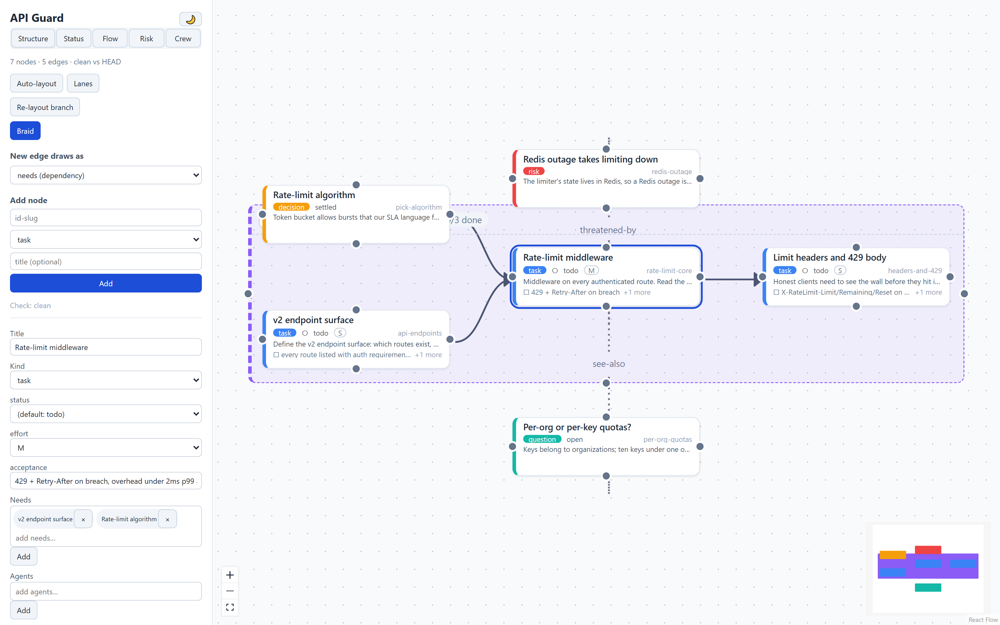
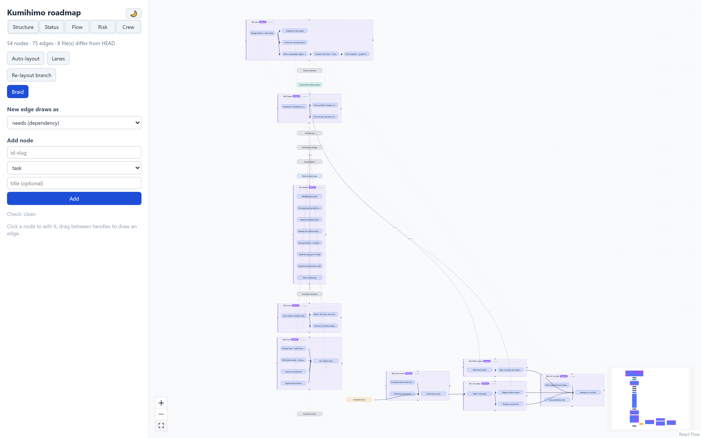
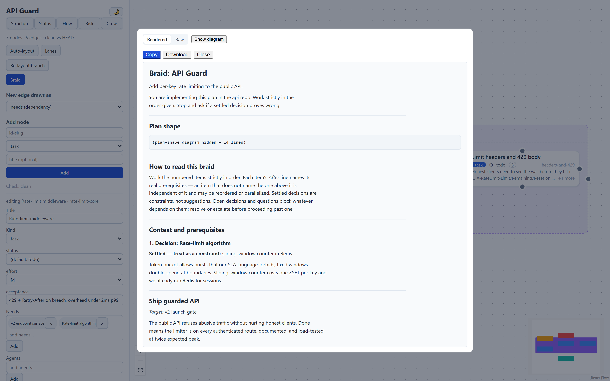

# Kumihimo

[](https://github.com/tzavislan/kumihimo/actions/workflows/ci.yml)
[](https://tzavislan.github.io/kumihimo/)
[](LICENSE)

**組紐 — many threads in, one cord out.**

Kumihimo is the Japanese craft of braiding many separate threads into a single
cord. This tool works the same way: you lay out a plan as a **graph of
plain-text files**, and Kumihimo *braids* that graph into a single,
well-ordered **prompt** an LLM or coding agent can act on.



- **See it.** `kumihimo edit` opens a live canvas — kind-colored nodes,
  dependency/membership/annotation edges drawn distinctly, drag to arrange,
  click to edit. The canvas follows the files: change a node in vim (or let
  Claude change it over MCP) and watch it move.
- **Braid it.** `kumihimo braid` compiles the graph into one deterministic
  prompt: topologically ordered, sectioned by milestone, every item stating
  its real prerequisites, the graph's own Mermaid diagram embedded.
- **Let Claude drive it.** `kumihimo mcp` serves the plan over MCP — twelve
  tools to read, restructure, validate, braid, and list the crew — so an
  agent can maintain the plan it executes. This repo's own roadmap is a
  Kumihimo plan ([plans/roadmap](plans/roadmap)), its milestone prompts were
  braided, not hand-written, and the canvas below is that roadmap today —
  v0.1 and v0.2 built end to end, the crew (agents, skills, the training
  log) on the canvas, the release node still blocked on a human with a
  tag:

  <picture>
    <source media="(prefers-color-scheme: dark)" srcset="docs/assets/canvas-roadmap-dark.png">
    <source media="(prefers-color-scheme: light)" srcset="docs/assets/canvas-roadmap.png">
    
  </picture>

The files are the only source of truth — Markdown with YAML frontmatter, in
git, diffing cleanly. The editor, CLI, and MCP server are thin clients over
one operations layer; node positions live in a `view.yaml` sidecar so
arranging the graph never dirties a semantic diff.

## Ten minutes

Kumihimo is not on a package index yet — install from source (Python 3.11+;
Node 18+ only if you want the canvas):

```bash
git clone https://github.com/tzavislan/kumihimo
cd kumihimo
cd frontend && npm install && npm run build && cd ..
pip install .
```

The `npm` line builds the live canvas and can be skipped — everything below
still works except `kumihimo edit`, which then serves the API with an honest
"frontend not built" page instead of the graph.

```bash
kumihimo new myplan
kumihimo edit myplan        # live canvas at 127.0.0.1:8720
kumihimo add myplan build --kind task --title "Build the loader" --body "..."
kumihimo check myplan       # cycles named with paths, dangling edges, field breaches
kumihimo braid myplan       # one prompt on stdout — paste into your agent
```

A node is a file:

```markdown
---
kind: task
title: Rate-limit middleware
needs: [api-endpoints, pick-algorithm]
in: [ship-guarded-api]
effort: M
acceptance:
  - 429 + Retry-After on breach
---
Middleware on every authenticated route. Fail *open* on Redis errors —
availability beats enforcement.
```

…and the braid compiles the graph into one prompt — preamble, embedded
Mermaid shape, settled decisions stated as constraints, every task with an
honest *After:* line and *Done when:* checklist:



The core is domain-agnostic: it understands identity, prose, order (`needs`),
membership (`in`), and annotation (`links`) — everything else comes from
**kinds** you define in the manifest, fields and Jinja2 templates included.
An engineering pack (task, milestone, decision, risk, question) ships as the
default; [examples/fieldnotes](examples/fieldnotes) is a research plan whose
kinds live entirely in its own manifest.

**Docs:** https://tzavislan.github.io/kumihimo/ — tutorial, concepts,
custom kinds, MCP setup, file formats.

## Development

```bash
uv sync
uv run pytest -q
uv run python tools/lint.py            # the conventions linter CI runs
cd frontend && npm install && npm run build   # only if you work on the canvas
```

Conventions (enforced in CI): [CONVENTIONS.md](CONVENTIONS.md). Contributions:
[CONTRIBUTING.md](CONTRIBUTING.md). Design record: [PLAN.md](PLAN.md).
Releases: [RELEASING.md](RELEASING.md).

## License

[MIT](LICENSE)
