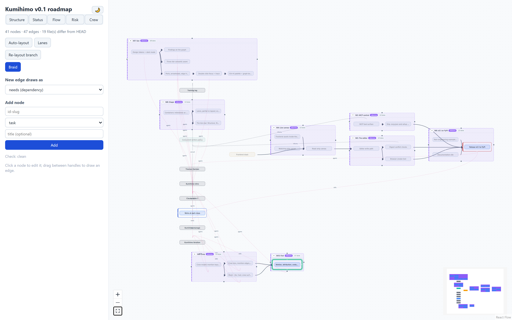

# The editor

```bash
kumihimo edit myplan          # serves 127.0.0.1:8720 and opens the browser
```

The canvas renders the plan live: kind-colored nodes, solid arrows for
`needs`, dashed edges for membership, dotted labeled edges for annotations,
and thin dotted labeled edges for mentions (who's assigned, what skill, who
trains it). The sidebar carries the live `check` findings, an add-node form,
the braid button, a session-scoped [undo trail](#undo), and — when the plan
lives in git — a dirty-vs-HEAD indicator.

Everything you do writes through the same operations layer as the CLI:

- **Drag a node** — its position lands in `view.yaml`, never in a node file.
- **Drag handle to handle** — draws an edge; the selector above the canvas
  chooses whether new edges mean `needs`, `in`, or an annotation `link` (with
  a relation label). An edge that would close a dependency cycle is refused
  with the cycle's path. Mentions (`agents:`/`skills:`/`trains:`) are never
  drawn this way — see "Chip editors" below.
- **Click a node** — edit title, kind, fields (inputs generated from the
  kind's schema), chip rows for `needs`/`agents`/`skills` (see "Chip
  editors"), and body; **Save** writes the file, preserving any hand-
  written comments in its frontmatter. Rename fixes every referrer; Delete
  refuses while referenced, naming the referrers.
- **Click an edge** — opens the edge panel in the sidebar (see "Reading
  edges" below).
- **Braid** — compiles the current plan and shows it styled, in both themes,
  with Copy and Download (see "Braid preview" below).

## Reading edges

Each edge kind keeps its own ports, so membership stops fighting dependency
arrows for the same two pixels: `needs` edges run left→right, from the
dependency's right handle to the dependent's left handle. `in` (membership),
`link` (annotation), and mention (`agents:`/`skills:`/`trains:`) edges all
run bottom→top — member, link source, or mentioning node at the bottom,
group/link target/mentioned crew member at the top — distinguished from each
other by dash pattern, color, and label, not by port. `needs` and `in` edges
carry a closed arrowhead pointing at the dependent/group; `link` and mention
edges carry none, since neither is a directional dependency — an annotation
is a labeled relation, and a mention carries no ordering at all (the topo
sort never looks at it).

Mentions render thinner and more sparingly-styled than the other three kinds
— they're meant to recede until you go looking for them, or switch to the
[Crew lens](#lenses) below, which is built for exactly that. Each carries a
small label naming which key it is: "agents", "skills", or "trains".

Hovering an edge thickens and brightens its stroke and shows a small tooltip
naming it in words — "rate-limit-core needs pick-algorithm" — using titles,
never ids. Clicking an edge opens a panel with that same sentence, a jump
button per endpoint (selects the node and centers the canvas on it, zoom
unchanged), and the Remove edge button — mention edges included, described
as "A mentions B (agents)" and so on.

## Chip editors

The sidebar's node form carries three chip rows — **Needs**, **Agents**,
**Skills** — each showing the node's current targets as removable pills
(titles, not ids) plus an add input. Typing an id and pressing **Enter**, or
clicking **Add**, posts a `link` op immediately; clicking a chip's **×**
posts `unlink` — neither is staged behind the form's Save button, the same
"the gesture is the op" model drawing or removing a canvas edge already
uses. The add input suggests ids from a plan-wide list, filtered per field:
**Needs** suggests every non-crew node (not itself an `agent` or `skill`),
**Agents** suggests only `agent`-kind nodes, **Skills** only `skill`-kind
ones — but the suggestion list is a convenience, not a gate: typing an id
outside it still submits, and `check`'s own rules (dangling target, wrong
kind) are what actually enforce it, surfacing as the same conflict/error
notice any other op uses.

There is no **Trains** chip row. `trains:` targets stay file-edited on
purpose — it is the retro's edge, set rarely and deliberately (typically once
per recurring training task), not a relationship you build up node by node
the way needs/agents/skills are.

## Containers

A node that at least one other node names in its `in` renders as a
container instead of a plain card: its members sit inside it, sized and
positioned to bound them plus a title-bar strip. The dashed membership line
"Reading edges" describes above never draws for that primary relationship —
the nesting says it instead; a member's *other* `in` entries (a second
group, or a target that isn't itself a container) still draw as ordinary
edges. Membership assignment matches the braid's own grouped-strategy
sections: a node's container is the first `in` target that is itself a
container, so what nests on the canvas is what sections in the compiled
prompt.

The container's title bar carries a small **▸/▾** button. Clicking it
collapses the container to a normal-card-sized chip showing a kind pill, an
*n*/*m* **done** count (members whose effective status is `done`), and a
member count — its members vanish from the canvas, and any edge that
touched one re-targets to the chip instead (two edges landing on the same
chip pair merge into one; an edge whose both ends fold into the same chip
disappears rather than drawing a loop). Collapse state is per-plan view
state, saved to `view.yaml`'s `collapsed` key exactly like positions — it
survives a reload and echoes to every other connected editor.

Jumping to a node that's currently hidden inside a collapsed container — via
the Ctrl+K palette, a clickable finding, or an edge panel's endpoint button —
selects and centers the **container** instead of silently doing nothing, and
a notice names what happened: "*title* is inside collapsed *container* —
expand to open it." Nothing auto-expands; that stays a deliberate click on
the ▸ button.

The container card is otherwise a normal node: click it to open its form,
double-click to focus it, and it takes part in every halo and lens like any
other card. Every layout mode below (Auto, Lanes) treats a *collapsed*
container as one node at chip size, laid out along its (re-routed) needs
edges same as any leaf. An *expanded* container is never laid out as a
cluster by Lanes, and only sometimes by Auto — see "Layout" below for what
each mode does with its members instead. Members stay individually
draggable inside their container, which is today's way to shape a group by
hand.

## Focus and trace

Double-click a node to focus it: everything it needs (upstream) tints
fuchsia, everything that needs it (downstream) tints lime, each fading over
three steps with distance, and every unrelated node dims to about 15% (the
minimap follows too, showing dimmed nodes as faint gray). The sidebar
shows a one-line "Focused on … — upstream *n*, downstream *m*" summary. Esc,
or clicking empty canvas, exits.

With a node selected, alt-click a second node to trace between them instead:
every node on any dependency path connecting the two — in either direction —
keeps full strength with a dashed ring, everything else dims, and the
sidebar shows a "*N* nodes on paths between A and B" summary with a Clear
button. If the two aren't connected by any `needs` chain, a notice says so
and trace mode isn't entered. Esc clears trace the same way it exits focus.

Double-clicking a **container** focuses the union of its members' own cones
instead of the container's own (always empty) needs list — everything any of
its threads needs or is needed by, minus its other members — and the sidebar
summary grows a member count: "Focused on M8 — Shape (6 members) — upstream
2, downstream 1."

Both lenses see through a collapsed container: if a hidden member sits in the
upstream or downstream cone (or on a trace path), its container tints or
lights up in its place, and a `needs` edge that got rerouted onto a chip
still dims or stays bright by the real endpoints its file names, never by
whatever the chip happens to be. Both are purely client-side view state,
computed over the `needs` edges already in the payload — nothing is written
to disk, and a live payload update (another editor, a file edit) recomputes
the cones instead of kicking you out, unless the node you'd focused or traced
is itself gone. Entering either one also pauses the lens bar's own tinting
(below) until Esc — see "Lenses"' precedence note.

## Findings on the canvas

A node named by a `check` finding gets a soft ring around its card — red for
an error, amber for a warning, error winning when a node carries both.
Sidebar finding rows underneath the counts stay in sync with the same rule:
a row whose finding points at a node (rather than a file like
`kumihimo.yaml`) is clickable — click it to select and center that node, the
same jump an edge panel's endpoint buttons do. Findings against a file list
the same as always, just not clickable. When `check` finds nothing, the
heading reads a quiet "Check: clean" instead of the usual counts.

## Semantic zoom

Nodes render differently depending how far you've zoomed, so a small plan
reads as a card catalog and a large one still reads as a plan instead of a
wall of identical boxes. Three tiers, switched on React Flow's zoom level:

- **Far** (zoom below 0.45) — a compact colored chip: the kind's color as a
  tint, the title, nothing else. This is the plan's silhouette — scroll out
  far enough on a big roadmap and you're reading shapes and titles, not
  cards.
- **Mid** (0.45 up to 1.3) — the normal card: title, kind pill, id, and now
  also a status glyph (○ todo, ◐ doing, ● done, ⛔ blocked) beside the status
  text, an effort chip when the node has one, and — on milestone nodes — a
  member-count badge ("*n* threads") counting how many nodes name it in
  their `in`. This is the default working zoom.
- **Near** (zoom 1.3 and above) — the mid card plus a one-line body preview
  and, when the node has an `acceptance` list, its first item as a read-only
  `☐` line with a "+*n* more" count alongside. Zoom in on one node to read a
  little more of it without opening the sidebar form.

A card's on-canvas footprint never changes size between tiers, near
included: everything above packs into the same box mid and far already use,
in smaller type — readable because you're zoomed in to see it. That keeps
dragging, edges, and the auto-layout stable across a zoom gesture, and
means cards never grow into their neighbors as you zoom in.

## Lenses




A five-way switch at the top of the sidebar — **Structure** (the default,
everything described above), **Status**, **Flow**, **Risk**, **Crew** —
changes what the canvas emphasizes without changing what it contains. Click
a tab, or press `1`-`5` with the canvas focused and no form field active. A
lens choice is pure view state: nothing is written to disk, and it survives
a payload echo untouched.

- **Status** tints each node by its effective status: doing picks up the
  accent color, blocked the error color, done dims and desaturates by about
  45%. The **ready frontier** — every node whose own status is `todo` and
  whose every dependency is satisfied — glows with its own ring. This is the
  same computation the MCP `ready()` tool uses, to the letter: a node is
  never shown as ready here and refused as not-ready there, or the reverse.
  A dependency hidden inside a collapsed container still counts as satisfied
  or not the same as if it were visible; if the ready node itself is the one
  that's hidden, its container glows in its place rather than the fact
  disappearing.
- **Flow** finds the longest `needs` chain through the graph — the critical
  path — and bolds its nodes and edges; every other edge fades. A collapsed
  container stands in for its hidden members here exactly as it does for
  auto-layout, so the chain can run straight through a chip.
- **Risk** enlarges every `risk`-kind node and every `decision`/`question`
  still `open`, gives them a stronger border, and shades everything
  downstream of them (through `needs`, containers substituted the same way
  as Flow) — the blast radius of what's currently unresolved. Everything
  else dims slightly.
- **Crew** tints every node by its first `agents:` entry — a stable color per
  agent, assigned by sorting every `agent`-kind node's id and stepping a hue
  wheel evenly across them, so the same plan always assigns the same colors.
  An `agent` node gets its own hue at full strength; anything that merely
  mentions one gets a softer tint of that same hue, so a source and its
  mentioners visibly share a color family without being confused for each
  other. A `task`-kind node with no `agents:` at all — unassigned work — gets
  a dashed cyan outline instead of a tint. `skill:` mentions get no color of
  their own (there's no "first skill" the way there's a first agent); at the
  near zoom tier they instead render as small read-only chips on the card
  naming each one. Edges invert Flow's emphasis: `trains:` mentions bold and
  pop, every other edge — needs, in, links, and the other two mention keys —
  fades, so "who trains the crew" reads at a glance against everything else
  receding.


**Precedence**, when more than one visual channel would apply to the same
node: a finding halo always wins, and for the two lens treatments that dim a
card (Status's done tinge, Risk's "everything else" dim) that's an
exclusion, not just a preference — a haloed node never gets those classes at
all, so the ring always renders at full, undimmed strength rather than being
faded along with the rest of the card the way plain CSS layering would fade
it (opacity dims a box-shadow too; a done node with an error halo used to
show no discernible ring until this was enforced). The Status lens's
ready-glow uses the same box-shadow channel as a halo and loses to it the
same way. Risk's enlarge-and-border (a source) and shaded wash (its blast
radius), and Crew's unassigned-work outline, don't dim anything, so they
still show alongside a halo — Crew's node tint doesn't compete with a halo
either, since it colors the same border-left stripe the kind color always
occupies rather than adding a second ring. Focus and
trace suspend lens emphasis entirely while active: the lens stays selected,
but its tints, bolding, and shading pause until Esc, since both already use
the same border/opacity channels a lens does and showing both at once would
just be noise. Semantic zoom tiers are unaffected by any of this.

## Command palette and keyboard

`Ctrl+K` (`Cmd+K` on macOS) opens a search palette over every node's id,
title, and body, plus six quick commands (Add node, Braid, Toggle theme,
Toggle auto-layout, Lanes layout, Re-layout branch). With the palette closed
and focus outside any form
field, `1`-`5` switch the lens bar above from anywhere on the canvas; with a
node also selected, arrow keys walk the graph itself rather than the screen,
F focuses, and Delete or Backspace removes with a confirmation. The full
gesture-by-gesture table — this and everything above — lives in the
[shortcuts reference](../reference/shortcuts.md).

## Sync, conflicts, and undo

The canvas never holds unsaved state — there is no save button for the plan,
only for the node form, and even that writes immediately. External edits
(vim, MCP, `git checkout`) reach the canvas in well under a second via the
file watcher.

Each form save carries the digest of the file it was based on. If someone
else changed that file meanwhile, the save is rejected with a conflict notice
and nothing is clobbered — refresh (the watcher already did) and re-apply.

### Undo

A collapsible **Undo** section in the sidebar, just below the Braid button,
lists every op *this browser tab* has applied this session — newest first,
session-scoped and in-memory, so a reload starts it empty. It is not a
history of the plan, only of what you just did here; for anything else,
undo is still git (below). Every entry is a button carrying a plain-language
label ("*set crew-model status: doing → done*", "*link: cache needs
redis-outage*"); click one, or press **Ctrl+Z** (**Cmd+Z** on macOS,
[shortcuts reference](../reference/shortcuts.md)) to fire the topmost
*enabled* one. Either way the entry's inverse posts through the exact same
`/api/ops` write door every other gesture already uses — there is no second
path that bypasses `core.ops`. That posted inverse gets a response with its
own inverse, which lands back on the trail as a fresh entry: undoing an undo
is just clicking (or Ctrl+Z-ing) again.

An entry stays enabled only while the node file it touched hasn't changed
since. The server computes each inverse from the exact state read just
before its op ran and ties it to that same node's digest right after —
the moment anything else touches that file first (another editor tab, an
MCP or CLI mutation, a hand edit), the entry grays out with its reason
("*rate-limit-core changed since*") instead of silently applying a now-wrong
inverse. Undoing an `unlink` re-draws the edge it removed, which can rarely
be refused the same way drawing a fresh edge can: if the graph changed
enough in between that redrawing it would now close a dependency cycle, the
op door says so and the entry stays on the trail, still enabled, for another
attempt.

**Removing a node has no inverse.** Undoing a delete would mean recreating a
file from memory the disk no longer has any trace of — dishonest for a tool
whose whole model is "files are the only truth." The trail still logs that
the removal happened, just permanently grayed, with no button that does
anything. For that, and for anything from outside this one browser tab's own
session, undo is git: every session's worth of edits is a reviewable diff,
and `git checkout -- .` is a bigger undo than any editor ships.

## Layout

`view.yaml` positions win when present; the elk layered algorithm fills the
gaps. The **Auto-layout** button toggles to a pure elk arrangement (left to
right along dependencies) without touching your saved positions — click it
again ("Use view.yaml") to go back. Both Auto and the two actions below are
ephemeral: nothing is written to `view.yaml` until you drag a node, exactly
like today's Auto-layout always worked.

**Lanes**, next to it, is a second one-shot arrangement: one column per
node's **NEEDS-DEPTH** (its longest dependency-chain distance from a root —
a node with no `needs` of its own), generously spaced left to right. A
collapsed container counts as one node here too, standing in for its hidden
members exactly as Auto's elk layout does. Unlike Auto, Lanes never clusters
an *expanded* container's members as a tight group — each one gets its own
column purely by its own needs-depth, so a container's members can end up
spread across several lanes; its frame still bounds wherever they land, the
same as it always has for a hand-dragged group, and a wide frame with only a
few cards inside one end of it is the expected result of a spread-out lanes
arrangement, not a bug. Every container that currently has visible members
gets its own vertical *band* — a reserved horizontal strip nothing else is
ever placed in — so two containers' frames, or a frame and a collapsed
chip, can never land on the same pixels; everything ungrouped (plain leaves
and collapsed chips alike) shares one further band at the bottom. That
guarantee costs some vertical compactness: a band reserves room for its
single busiest column across every column it spans, so a container with one
crowded lane and several sparse ones leaves visible empty space beside the
sparse ones — a deliberate tradeoff, not a bug either.

**Re-layout branch**, near the layout buttons (and in the Ctrl+K palette),
re-arranges just one part of the plan around your current selection, leaving
everything else exactly where it was. The scope is the selection's
**container-or-cone**: if you've selected a container, its members; otherwise
the selected node plus everything it needs and everything that needs it
(its full dependency cone). Elk lays out only that scope, then the whole
result is shifted — never resized or rotated — so its center lands back on
roughly where the scope's center was before, rather than jumping to some
unrelated corner of the canvas — *when there's room*: if that placement
would land the scope on top of anything outside it, the whole result slides
further, clear of every other card and container frame, before landing.
Centroid preservation is therefore best-effort, not a guarantee: the common
case keeps the branch right where it was, and a crowded one moves it the
short distance needed to stay collision-free instead. Like Auto and Lanes,
this writes nothing to `view.yaml`.

## Braid preview

**Braid** compiles the current plan and opens it in a modal, styled like a
document — headings, lists, `code`, tables, and blockquotes — in both light
and dark, using the same tokens as the rest of the canvas. **Rendered** is
the default view; **Raw** switches to the compiled Markdown exactly as
written, the same plain-text view the modal always had. Your choice is
remembered for the rest of the session (not across a reload).

Node bodies are user-authored text, not trusted input, so the renderer never
produces an executable or navigable hostile element from one: raw HTML in a
body (`<script>`, ``, an `<iframe>`, an inline event-handler
attribute) is escaped to inert, visible text rather than passed through, and
a link's or image's own URL is checked against an allow-list before it's
ever wired into a live `href`/`src` — `http:`/`https:`/`mailto:` (links) or
`http:`/`https:`/a relative path (images) pass through; anything else —
`javascript:`, `data:`, or any other scheme, including the classic
`[text](javascript:…)` and CommonMark's own `<javascript:…>` autolink form —
renders as the link's plain text instead, with no `<a>` or `` at all.
Both views are covered the same way. The first time you open a braid, the
styled renderer is fetched on demand — it is not part of the page's initial
download, so it costs nothing until you actually open one.

The compiled braid embeds one Mermaid diagram (the "Plan shape" section) —
rendered natively by GitHub and by this project's own docs site, but not
here: drawing it would pull in a renderer heavy enough to compete with the
rest of the app's own load time, so the preview always shows it as source
inside a fenced code block instead. Since that source can run to dozens of
lines on a large plan, the **Diagram** toggle folds it down to a one-line
"(plan-shape diagram hidden — *N* lines)" placeholder by default, in both
Rendered and Raw — click it to unfold the real source when you want to read
it here.

**Copy** and **Download** both always hand over the complete, real braid —
never a copy with the diagram folded away, regardless of what the toggle is
currently showing on screen. Download saves it as
`<plan-name-slug>.braid.md`, byte-for-byte identical to what `kumihimo
braid`/`GET /api/braid` would produce; nothing is re-serialized or has its
line endings translated on the way to the file.

## Motion and attribution

A position that changes because of something *other* than your own drag —
another editor's change arriving over the live socket, an MCP edit, or one
of the layout actions above — glides to its new spot over about 200ms
instead of jumping there. Dragging itself stays instant, with no glide, so
the card never lags behind your pointer. If your OS is set to reduce motion,
every glide is skipped in favor of an immediate move.

A change from *outside this browser tab* also says who and pulses where.
Every mutating op — CLI, MCP, or another editor tab's own gesture — appends a
line to the plan's advisory `.kumihimo/events.jsonl`
([format reference](../reference/formats.md#kumihimoeventsjsonl)); the next
live-socket push carries whatever's new there since the last one, and the
canvas matches it against the node ids that actually changed. One toast per
source, top-right, newest on top (up to four kept, each dismissing itself
after about six seconds, or on click): "*via CLI: rate-limit-core
updated*", "*via MCP: crew-model, headers-and-429, pick-algorithm +1 more
updated*" — up to three names, then a count of however many more. Added
and removed nodes say so ("*added*"/"*removed*" in place of "*updated*"); a
change with no matching event — a hand edit, `git checkout`, some other
tool — reads "*outside edit*" instead of a source. The nodes actually
involved briefly ring (a hidden container member's ring lands on its
collapsed chip instead, the same substitution focus/trace and the lenses
already make); reduced motion drops the ring but never the toast — the
information stays, only the motion goes. **Your own edits in this tab never
toast or pulse** — the op's own response already updated what you're
looking at, so there's nothing left to announce.

## Dark mode

A moon/sun toggle sits next to the plan name at the top of the sidebar. On
first load it follows your OS's light/dark preference; after that, your
choice is remembered (`localStorage`) and wins over the OS setting until you
toggle back.
