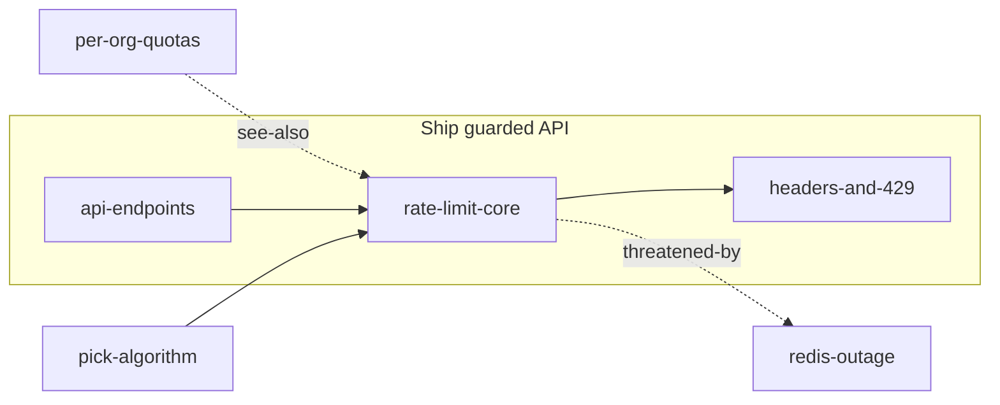

# Braid: API Guard
Add per-key rate limiting to the public API.

You are implementing this plan in the api repo. Work strictly in the
order given. Stop and ask if a settled decision proves wrong.

## Plan shape

## How to read this braid

Work the numbered items strictly in order. Each item's *After* line names its
real prerequisites — an item that does not name the one above it is
independent of it and may be reordered or parallelized. Settled decisions are
constraints, not suggestions. Open decisions and questions block whatever
depends on them: resolve or escalate before proceeding past one.

## Context and prerequisites

### 1. Decision: Rate-limit algorithm

**Settled — treat as a constraint:** sliding-window counter in Redis

Token bucket allows bursts that our SLA language forbids; fixed windows
double-spend at boundaries. Sliding-window counter costs one ZSET per key and
we already run Redis for sessions.

## Ship guarded API

*Target:* v2 launch gate

The public API refuses abusive traffic without hurting honest clients. Done
means the limiter is on every authenticated route, documented, and load-tested
at twice expected peak.

### 2. v2 endpoint surface · effort S
*After:* nothing — ready as soon as you reach it.
*Independent of the item above — reorderable.*

Define the v2 endpoint surface: which routes exist, which are authenticated,
and which carry per-key limits. The limiter hangs off this map, so it lands
first.

Done when:
- [ ] every route listed with auth requirement and limit tier
- [ ] reviewed by the platform team

### 3. Rate-limit middleware · effort M
*After:* 2. v2 endpoint surface; 1. Rate-limit algorithm

Middleware on every authenticated route. Read the key's window from Redis,
increment, compare against the tier limit. Fail *open* on Redis errors —
availability beats enforcement; see redis-outage for the standing mitigation.

See also: Redis outage takes limiting down (threatened-by).

Done when:
- [ ] 429 + Retry-After on breach
- [ ] overhead under 2ms p99 at 1k rps

### 4. Limit headers and 429 body · effort S
*After:* 3. Rate-limit middleware

Honest clients need to see the wall before they hit it: emit the standard
X-RateLimit-* headers on every limited response, and make the 429 body point
at the documentation instead of being a bare status.

Done when:
- [ ] X-RateLimit-Limit/Remaining/Reset on every limited route
- [ ] 429 body links the public rate-limit docs

## Ungrouped

### 5. Question: Per-org or per-key quotas?

**OPEN QUESTION** — do not silently assume an answer; ask, or flag the assumption you make.

Keys belong to organizations; ten keys under one org can multiply a quota
today. Do we aggregate limits per org in v2, or ship per-key and revisit?
Sales wants per-org for enterprise tiers; per-key ships sooner.

### 6. Risk: Redis outage takes limiting down

*Impact if it lands:* no rate limiting while Redis is unreachable
*Standing mitigation:* fail open, alert loudly, coarse per-IP cap at the load balancer as backstop

The limiter's state lives in Redis, so a Redis outage is an enforcement
outage. We choose availability: requests flow unlimited, an alert fires, and
the load balancer's coarse per-IP cap holds the line until Redis returns.
