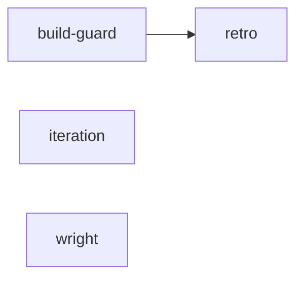

# Braid: Crew Demo
*Ground with:* grep the repo for the symbol first, then check docs/
A small plan exercising agents, skills, references, and mentions.

## Plan shape

## How to read this braid

Work the numbered items strictly in order. Each item's *After* line names its
real prerequisites — an item that does not name the one above it is
independent of it and may be reordered or parallelized. Settled decisions are
constraints, not suggestions. Open decisions and questions block whatever
depends on them: resolve or escalate before proceeding past one.

## Cast

- **Wright** (agent) — runtime: claude-code · model: claude-fable-5 · entry: claude code, this repo · trained: 2026-08-24
- **Kumihimo Iteration** (skill) — invocation: /kumihimo-iteration · source: .claude/skills/kumihimo-iteration/SKILL.md · cadence: every build pass · trained: 2026-08-24

## Ungrouped

### 1. Build the guard · effort M
*After:* nothing — ready as soon as you reach it.
*Also part of:* Launch
*Assigned:* Wright (wright)
*With:* Kumihimo Iteration (iteration)
*Consult:* Ward postmortem — docs/postmortems/ward.md (via recall query ward --corpus v1)

Implement the rate-limit guard. Check the postmortem before touching the
retry path — that is exactly what broke last time.

Done when:
- [ ] guard rejects the replayed request from the postmortem

### 2. Retro and retrain
*After:* 1. Build the guard
*Also part of:* Launch
*Trains:* Wright (wright), Kumihimo Iteration (iteration)

Fold what the guard build taught back into Wright's grounding and the
iteration skill.
